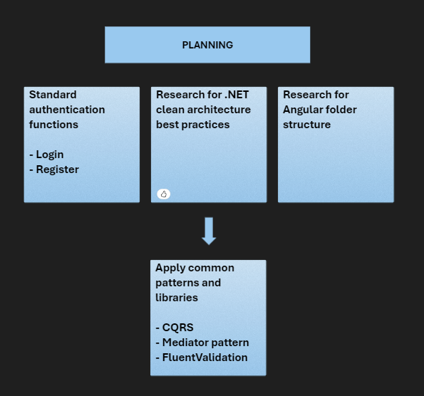
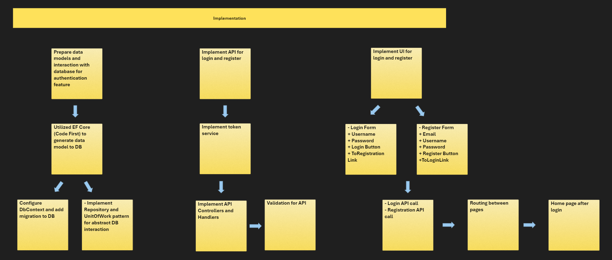

# Angular Mock Project
## **Workflow**




## **Folder Structure**

```
src/
  |-- public/
  |-- app/
  |     |-- app-routing.module.ts
  |     |-- app.module.ts
  |-- core/
  |     |-- components/
  |     |-- models/
  |     |-- services/
  |     |-- core.module.ts
  |
  |-- features/
  |     |-- authentication/
  |         |-- components/
  |         |-- services/
  |         |-- authentication-routing.module.ts
  |         |-- authentication.module.ts
  |     |-- home/
  |         |-- components/
  |         |-- home-routing.module.ts
  |         |-- home.module.ts
  |
  |-- shared/
  |-- index.html
  |-- main.ts
```

---

## **Libraries & pattern used**

1. **HttpClient** for calling APIs. 
2. **RouterModule** for routing. 
3. **ReactiveFormsModule** for form controls. 

---